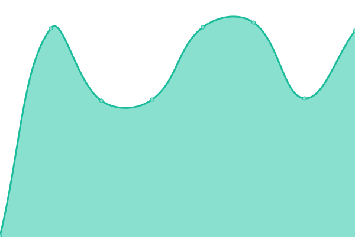

# Purrbot.site Status

This is the open-source Uptime monitor powered by [Upptime](https://upptime.js.org).  
You can find the site with the current live-status at https://status.purrbot.site

## <!--live status--> **🟩 All systems operational**

<!--start: status pages-->
<!-- This summary is generated by Upptime (https://github.com/upptime/upptime) -->
<!-- Do not edit this manually, your changes will be overwritten -->
<!-- prettier-ignore -->
| URL | Status | History | Response Time | Uptime |
| --- | ------ | ------- | ------------- | ------ |
|  [Bot](https://purrbot.site/shards) | 🟩 Up | [bot.yml](https://github.com/purrbot-site/Status/commits/HEAD/history/bot.yml) | 

 445ms
     
 | 

<a href="https://status.purrbot.site/history/bot">99.89%</a>
    

|  [Website](https://purrbot.site) | 🟩 Up | [website.yml](https://github.com/purrbot-site/Status/commits/HEAD/history/website.yml) | 

 160ms
     
 | 

<a href="https://status.purrbot.site/history/website">99.91%</a>
    

|  [Images API [/api/img/*]](https://purrbot.site/api/img/sfw/background/img) | 🟩 Up | [images-api-api-img.yml](https://github.com/purrbot-site/Status/commits/HEAD/history/images-api-api-img.yml) | 

 133ms
     
 | 

<a href="https://status.purrbot.site/history/images-api-api-img">99.92%</a>
    

<!--end: status pages-->

## 📄 License

- Powered by: [Upptime](https://github.com/upptime/upptime)
- Code: [MIT](./LICENSE) © [purrbot.site](https://purrbot.site)
- Data in the `./history` directory: [Open Database License](https://opendatacommons.org/licenses/odbl/1-0/)
