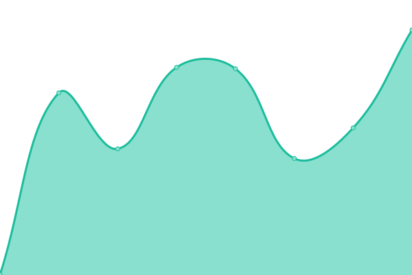
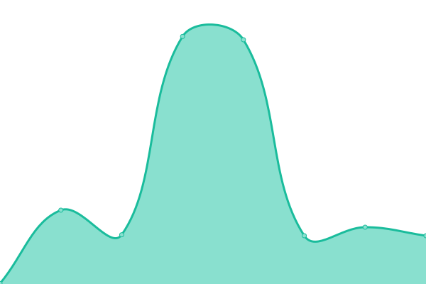

# [📈 Live Status](https://purrbot-site.github.io/Status): <!--live status--> **🟩 All systems operational**

This repository contains the open-source uptime monitor and status page for [purrbot.site](https://purrbot.site), powered by [Upptime](https://github.com/upptime/upptime).

With [Upptime](https://upptime.js.org), you can get your own unlimited and free uptime monitor and status page, powered entirely by a GitHub repository. We use [Issues](https://github.com/purrbot-site/Status/issues) as incident reports, [Actions](https://github.com/purrbot-site/Status/actions) as uptime monitors, and [Pages](https://purrbot-site.github.io/Status) for the status page.

<!--start: status pages-->
<!-- This summary is generated by Upptime (https://github.com/upptime/upptime) -->
<!-- Do not edit this manually, your changes will be overwritten -->
<!-- prettier-ignore -->
| URL | Status | History | Response Time | Uptime |
| --- | ------ | ------- | ------------- | ------ |
|  [Bot](https://purrbot.site/shards) | 🟩 Up | [bot.yml](https://github.com/purrbot-site/Status/commits/HEAD/history/bot.yml) | 

 378ms
     
 | 

<a href="https://status.purrbot.site/history/bot">100.00%</a>
    

|  [Website](https://purrbot.site) | 🟩 Up | [website.yml](https://github.com/purrbot-site/Status/commits/HEAD/history/website.yml) | 

 212ms
     
 | 

<a href="https://status.purrbot.site/history/website">100.00%</a>
    

|  [Images API [/api/img/*]](https://purrbot.site/api/img/sfw/background/img) | 🟩 Up | [images-api-api-img.yml](https://github.com/purrbot-site/Status/commits/HEAD/history/images-api-api-img.yml) | 

 108ms
     
 | 

<a href="https://status.purrbot.site/history/images-api-api-img">100.00%</a>
    

|  [Quote Image API [/api/quote]](https://purrbot.site/api/quote) | 🟩 Up | [quote-image-api-api-quote.yml](https://github.com/purrbot-site/Status/commits/HEAD/history/quote-image-api-api-quote.yml) | 

 292ms
     
 | 

<a href="https://status.purrbot.site/history/quote-image-api-api-quote">100.00%</a>
    

|  [Status Image API [/api/status]](https://purrbot.site/api/status) | 🟩 Up | [status-image-api-api-status.yml](https://github.com/purrbot-site/Status/commits/HEAD/history/status-image-api-api-status.yml) | 

 286ms
     
 | 

<a href="https://status.purrbot.site/history/status-image-api-api-status">100.00%</a>
    

<!--end: status pages-->

[**Visit our status website →**](https://purrbot-site.github.io/Status)

## 📄 License

- Powered by: [Upptime](https://github.com/upptime/upptime)
- Code: [MIT](./LICENSE) © [purrbot.site](https://purrbot.site)
- Data in the `./history` directory: [Open Database License](https://opendatacommons.org/licenses/odbl/1-0/)
