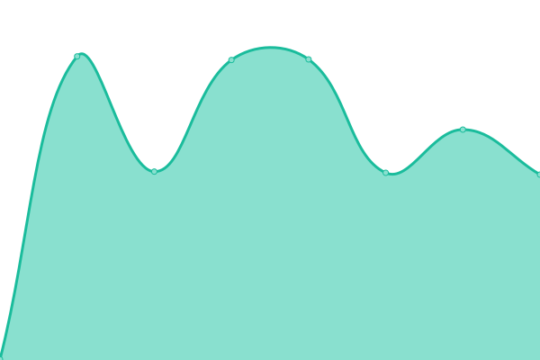
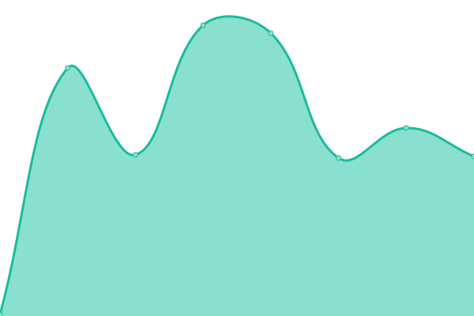

# Purrbot.site Status

This is the open-source Uptime monitor powered by [Upptime](https://upptime.js.org).  
You can find the site with the current live-status at https://status.purrbot.site

## <!--live status--> **🟥 Complete outage**

<!--start: status pages-->
<!-- This summary is generated by Upptime (https://github.com/upptime/upptime) -->
<!-- Do not edit this manually, your changes will be overwritten -->
<!-- prettier-ignore -->
| URL | Status | History | Response Time | Uptime |
| --- | ------ | ------- | ------------- | ------ |
|  [Bot](https://purrbot.site/shards) | 🟥 Down | [bot.yml](https://github.com/purrbot-site/Status/commits/HEAD/history/bot.yml) | 

 2814ms
     
 | 

<a href="https://status.purrbot.site/history/bot">99.97%</a>
    

|  [Website](https://purrbot.site) | 🟥 Down | [website.yml](https://github.com/purrbot-site/Status/commits/HEAD/history/website.yml) | 

 2634ms
     
 | 

<a href="https://status.purrbot.site/history/website">99.98%</a>
    

|  [Purrbot API [api.purrbot.site/*]](https://api.purrbot.site) | 🟥 Down | [purrbot-api-api-purrbot-site.yml](https://github.com/purrbot-site/Status/commits/HEAD/history/purrbot-api-api-purrbot-site.yml) | 

 392ms
     
 | 

<a href="https://status.purrbot.site/history/purrbot-api-api-purrbot-site">99.99%</a>
    

|  [Legacy API [/api/*]](https://purrbot.site/api/info) | 🟥 Down | [legacy-api-api.yml](https://github.com/purrbot-site/Status/commits/HEAD/history/legacy-api-api.yml) | 

 2585ms
     
 | 

<a href="https://status.purrbot.site/history/legacy-api-api">100.00%</a>
    

<!--end: status pages-->

## 📄 License

- Powered by: [Upptime](https://github.com/upptime/upptime)
- Code: [MIT](./LICENSE) © [purrbot.site](https://purrbot.site)
- Data in the `./history` directory: [Open Database License](https://opendatacommons.org/licenses/odbl/1-0/)
